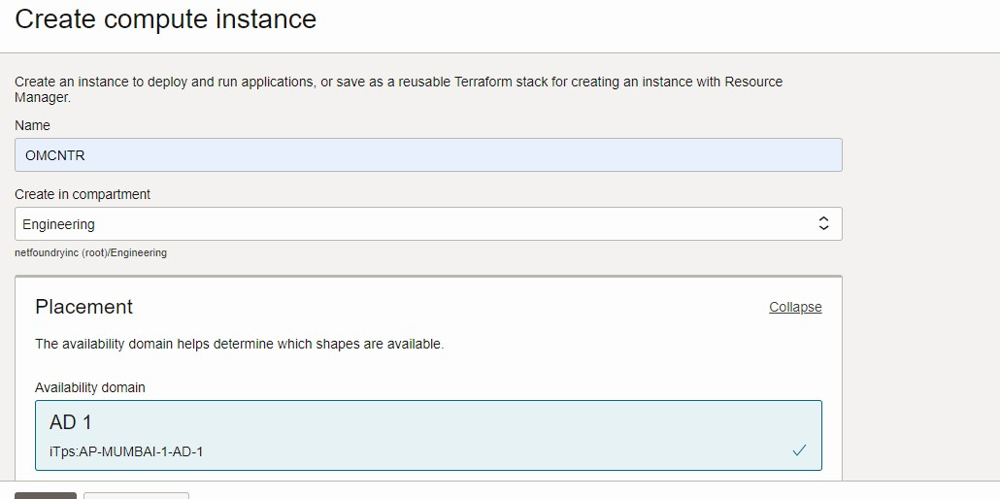
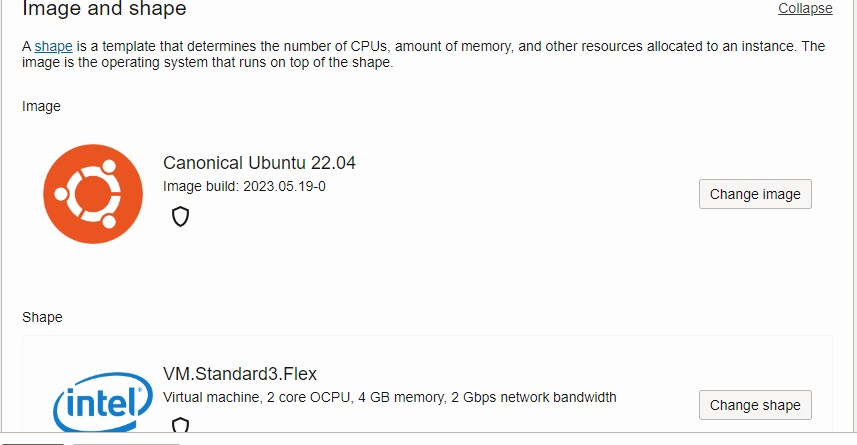
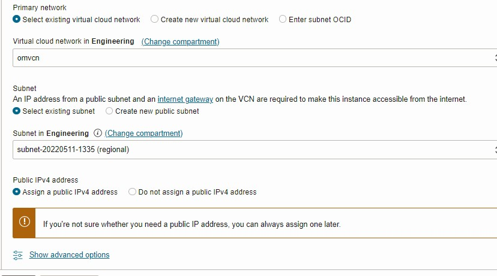
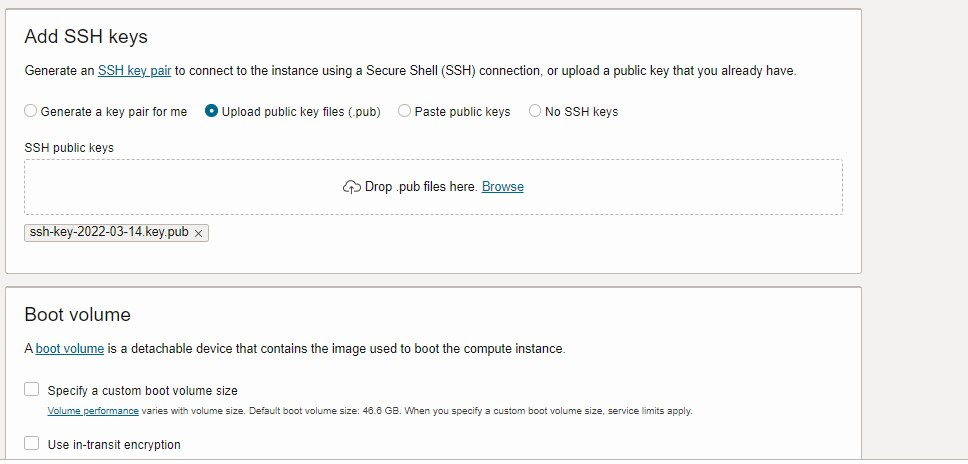
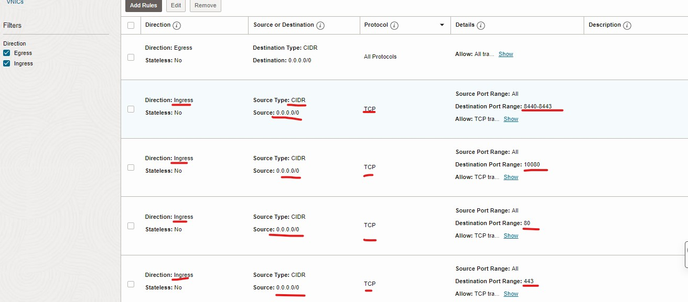
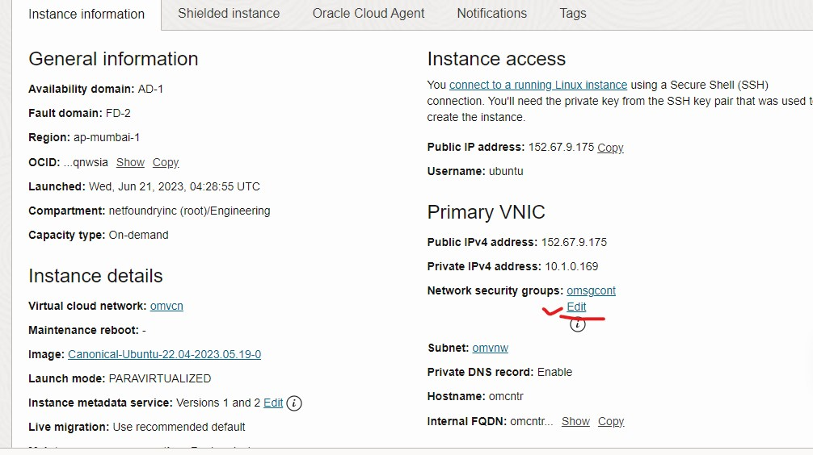

import Tabs from '@theme/Tabs';
import TabItem from '@theme/TabItem';

# 1.0 Configure the controller
## 1.1 Create a VM to be used as the Controller

<Tabs
  defaultValue="OCP"
  values={[
      { label: 'OCP', value: 'OCP', },
  ]}
>
<TabItem value="OCP">
login to OCP console. go to Home dashboard. Click on instance. Create the instance.Name the instance. Choose the compartment. Create a new compartment if you has not created before. Select the default placement. Let security disabled 



On Image and shape click change image icon. Select the ubuntu icon. Select the conical ubuntu 22.04. Select the any image build.
On shape click change shape. Select virtual machine. Shape series intel. Select shape name VM.standerd3.Flex. On security drop down select no of CPU 2 and memory 4 GB.



On the networking section. On primary network, select the existing virtual cloud network. Select the existing subnet. In public IPv4 check the assign public IP address. 



in the add SSH key section upload a public key file or paste the existing public key. Let default boot volume. Now click on create.



</TabItem> 
</Tabs>

## 1.2 Login and Setup Controller

<Tabs
  defaultValue="OCP"
  values={[
      { label: 'OCP', value: 'OCP', },
  ]}
>
<TabItem value="OCP">

Once the VM is created, we can get the IP address of the VM from the instance screen. 

Login to the VM by using user name "ubuntu", put the private key and IP address:
```bash
ssh -i <private_key> "ubuntu"@<ip>
```

Then follow the [Host OpenZiti Anywhere](/docs/learn/quickstarts/network/hosted/) to setup the controller. You must replace the EXTERNAL_DNS with the following command before running the quickstart.
 
**export EXTERNAL_DNS="$(curl -s eth0.me)"**

This ensures the Controller setup by the quickstart is advertising the external IP address of the VM.
</TabItem>
</Tabs>

## 1.3 Setup Ziti Administration Console (ZAC) 
**Optional**

ZAC provides GUI for managing the OpenZiti network. If you prefer UI over CLI to manage network, please following the [ZAC Setup Guide](/docs/learn/quickstarts/zac/) to setup ZAC before going to the next section.

<Tabs
  defaultValue="OCP"
  values={[
      { label: 'OCP', value: 'OCP', },
  ]}
>
<TabItem value="OCP">

To setup npm executables, you can follow [install Node.js guide](https://www.digitalocean.com/community/tutorials/how-to-install-node-js-on-ubuntu-22-04).

For example, this is how to install the version of node needed for ZAC.

Setup the repo:
```bash
cd ~
sudo apt update
curl -sL https://deb.nodesource.com/setup_18.x -o nodesource_setup.sh
sudo bash nodesource_setup.sh
```

Install nodejs:
```bash
sudo apt install nodejs
```
Now check the npm version
```bash
npm version
{
  npm: '9.5.1',
  node: '18.16.0',
  acorn: '8.8.2',
  ada: '1.0.4',
  ares: '1.19.0',
  brotli: '1.0.9',
  cldr: '42.0',
  icu: '72.1',
  llhttp: '6.0.10',
  modules: '108',
  napi: '8',
  nghttp2: '1.52.0',
  nghttp3: '0.7.0',
  ngtcp2: '0.8.1',
  openssl: '3.0.8+quic',
  simdutf: '3.2.2',
  tz: '2022g',
  undici: '5.21.0',
  unicode: '15.0',
  uv: '1.44.2',
  uvwasi: '0.0.15',
  v8: '10.2.154.26-node.26',
  zlib: '1.2.13'
}
```
After the nodejs is installed, following the rest of [ZAC Setup Guide](/docs/learn/quickstarts/zac/#cloning-from-github) to setup ZAC.

</TabItem>
</Tabs>

## 1.4 Firewall
<Tabs
  defaultValue="OCP"
  values={[
      { label: 'OCP', value: 'OCP', },
  ]}
>
<TabItem value="OCP">

---

OCP's by default Iptables/ufw(if ufw is enable) firewall is blocking all incoming access to the VM. If you not enable the ufw rule then you must have to configurethe following entry in the iptables rule.
You will need to open ports you specified for controller and ZAC (if you plan to use ZAC). 
Here is a example of the firewall ports if you used the default ports.

 - `8440/tcp`: Edge Controller providing router control plane
 - `8441/tcp`: Edge Controller providing client sessions
 - `8442/tcp`: Edge Router providing client connections
 - `8443/tcp`: Ziti Admin Console (ZAC) [optional]
 - `10080/tcp`: Fabric link connectivity from Customer router to Controller
 - `80/443/tcp`: Public ER to controller connectivity  
### controller ports:
if you enable the ufw firewall rule in OCP you must have to reboot the VM after applying the ufw rule.
UFW rules will takeover the iptables rule.
```
 sudo ufw allow 80/tcp
 sudo ufw allow 8440/tcp
 sudo ufw allow 8441/tcp
 sudo ufw allow 8442/tcp
 sudo ufw allow 8443/tcp
 sudo ufw allow 10080/tcp
 sudo ufw reload
 sudo reboot
```

### Same above entry need to configure in the OCP VCN security group.
click on 3 top left 3 line. Select the networking icon. select the virtual cloud networking. select the VCN. On the left down select the network security group. Select the create network security group. Name the security group and select the next. Now put the above entry in the inbound direction. Let everything open in the outbound direction.
Use following entry in OCP SG for controller



Then attach the above SG to the instance as bellow. select the network security group and select the edit. now select the security group from the drop down ans press save.



</TabItem>
</Tabs>
