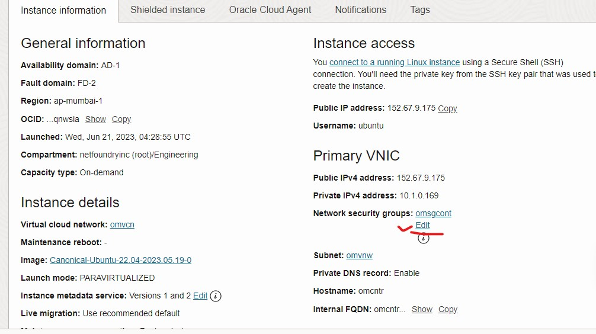

import Tabs from '@theme/Tabs';
import TabItem from '@theme/TabItem';

# 2.0 Configure new router using open ziti

In this section, we are describing how to setup the Edge Router (pub-er) for our [test network](Services#311-network-diagram-1).

## 2.1 Create the Edge Router VM 
Please follow **[Create a VM section](Controller/#11-create-a-vm-to-be-used-as-the-controller)** of the Controller Guide to setup a VM to be used as Router. 

## 2.2 Login and Update the repo and apps on VM

<Tabs
  defaultValue="OCP"
  values={[
      { label: 'OCP', value: 'OCP', },
  ]}
>
<TabItem value="OCP">
Once the VM is created, we can get the IP address of the droplet from the Resources screen. 

Login to the VM by using user name "ubuntu", put the private key and IP address:
```bash
ssh -i <private_key> "ubuntu"@<ip>
```
</TabItem> 
</Tabs>

## 2.7 Route Table 
<Tabs
  defaultValue="OCP"
  values={[
      { label: 'OCP', value: 'OCP', },
  ]}
>
<TabItem value="OCP">
We have to setup the route for non ziti client using egde router with tunneler enabled as a gateway. For remote site add route of subnet 100.64.0.0/10 and 11.11.11.11/32 as per following image. Select the default routing table in which VM subnet exist. select the add route rules then add the route rule. Select the target type Private IP destination type CIDR block and destination CIDR block 100.64.0.0/10 and 11.11.11.11/32 select the target as private IP of instance VM (ER). Then click the add route rules


</TabItem>
</Tabs>

## 2.8 Source and Destination Check
<Tabs
  defaultValue="OCP"
  values={[
      { label: 'OCP', value: 'OCP', },
  ]}
>
<TabItem value="OCP">

As per following image , check the "skip Source/Destination Check"

From your instance screen, come down left to resource click on the **attach NIC** of that VM. On the right side menu, choose **3 dots** (like the picture below).click edit NIC . **select skip Source/Destination Check** then **tick and save changes**


</TabItem>
</Tabs>

## 2.9 Firewall
<Tabs
  defaultValue="OCP"
  values={[
      { label: 'OCP', value: 'OCP', },
  ]}
>
<TabItem value="OCP">

OCP default firewall is iptables/ufw(if enableed) which is blocking all incoming access to the VM. You will need the following ports open for your ERs:

- 443/TCP (default port for edge listener)
- 80/TCP (default port for link listener)
- 53/UDP (when using as local gw)
- 22/TCP (SSH access, this rule by default allowed in iptable rule)
- 8080/TCP (HTTP testing from non ziti client)

public ER:
```
sudo ufw allow 80/tcp
```
local er 
```
sudo ufw allow 80/tcp
sudo ufw allow 53/tcp
sudo ufw allow 53/udp
sudo ufw allow 8080/tcp
```

click on 3 top left 3 line. Select the networking icon. select the virtual cloud networking. select the VCN. On the left down select the network security group. Select the create network security group. Name the security group and select the next. Now put the above entry in the inbound direction. Let everything open in the outbound direction.
Use following entry in OCP SG for ER


Then attach the above SG to the instance as bellow. select the network security group and select the edit. now select the security group from the drop down ans press save.




</TabItem>
</Tabs>
